# Cult Clash!

## Modify the README
Look here to make a good README: <https://github.com/adam-p/markdown-here/wiki/Markdown-Cheatsheet>

## Requirements
1) Install Node.js
    * Windows: <https://nodejs.org/dist/v10.16.0/node-v10.16.0-x64.msi>
2) Install TortoiseGit
    * Windows: <https://tortoisegit.org/>
3) Install MongoDB
    * Windows: <https://www.mongodb.com/>

## Use GIT
1) To start, Fork Git to your personal account. Go to <https://github.com/heygamerspigsquadgroup/Cult-Clash> to fork the repo.
    * This will give you your own repo to mess with however you like
    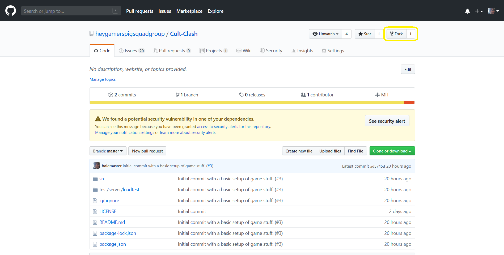
2) When you have an issue, it is best to make a feature branch in your repo. To do this, open Branches and type out the issue number. Make this branch in your own Fork, not in the master fork!
    * To do this, type this out the name of the branch you want and it will come up as a branch off of master in your repo.
    * Branches are just separate locations for code that you can contribute to without changing each other.
    * Basically you can do multiple different tasks at once in different branches, and then work on them at the same time, then commit when you are done with one. Lets you have reviews that are smaller.
    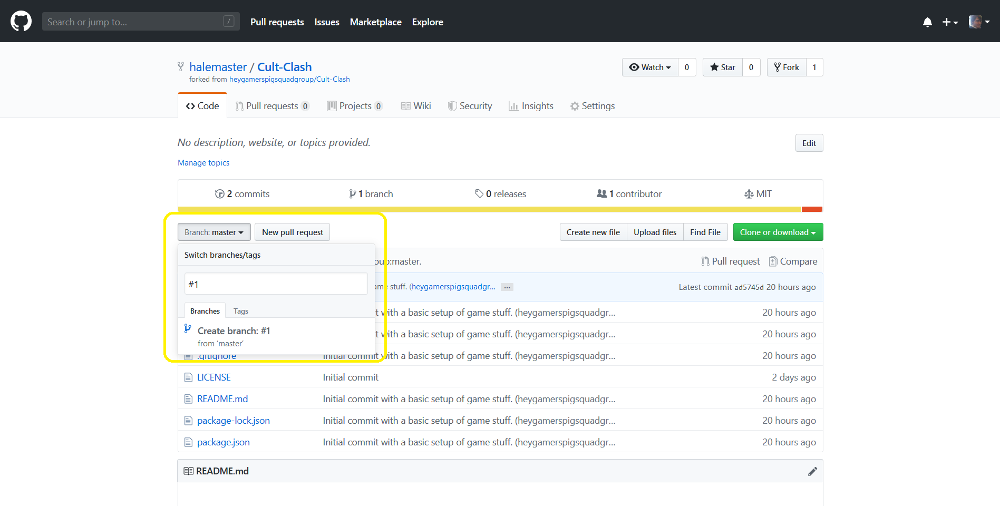
3) Download the repo via 'Clone'. This will put your personal repo on your computer.
    * The way GIT works is that you have a local version of your repo, and then you push those changes back up to your Github version of the repo.
    * Set up by copying your Fork via 'Clone' and clicking the button below
    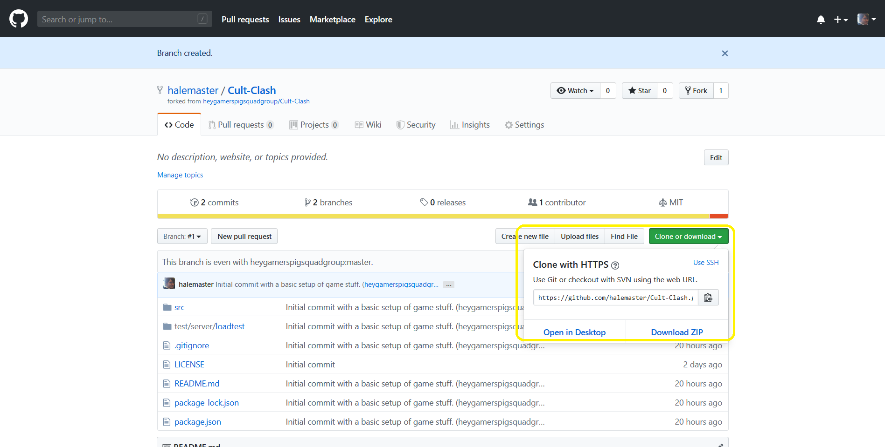
    * Use TortoiseGit to clone the repo by right clicking in a folder you want to check the code out to.
    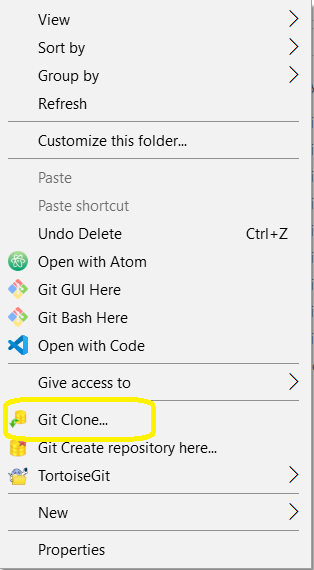
4) You'll want to set up something called 'upstream' for your local repo. This establishes the master repo as the upstream for your Fork.
    * You can do this by right clicking in the folder that you just cloned and selecting 'Git Sync...'
    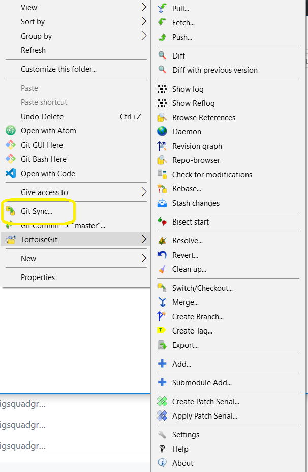
    * Then from the Sync menu, select Manage to get to your Remotes Management
    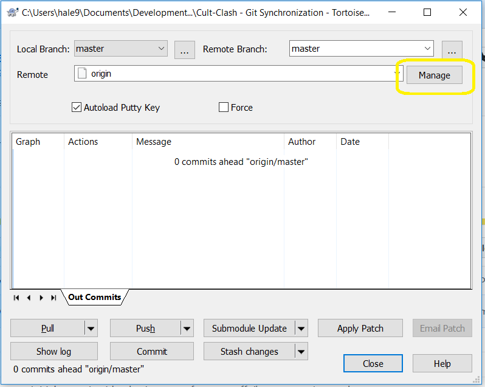
    * In here, write 'upstream' in the name, and then put the Clone location from the master repo in the URL section, then click Add/Save.
    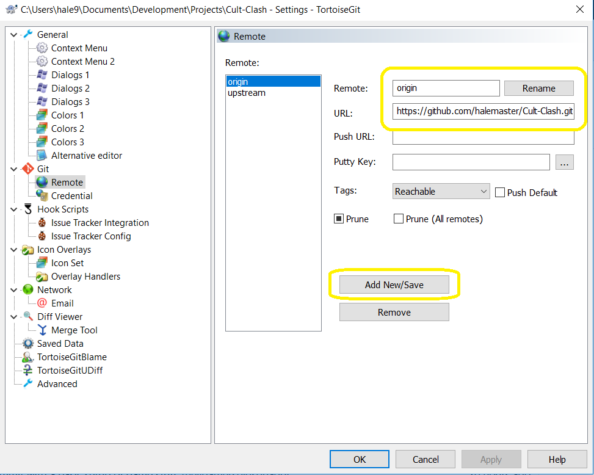
5) To get new updates from your remotes (both your Fork and the master repo), you'll need to do a Fetch
    * Right click in the folder and select Fetch
    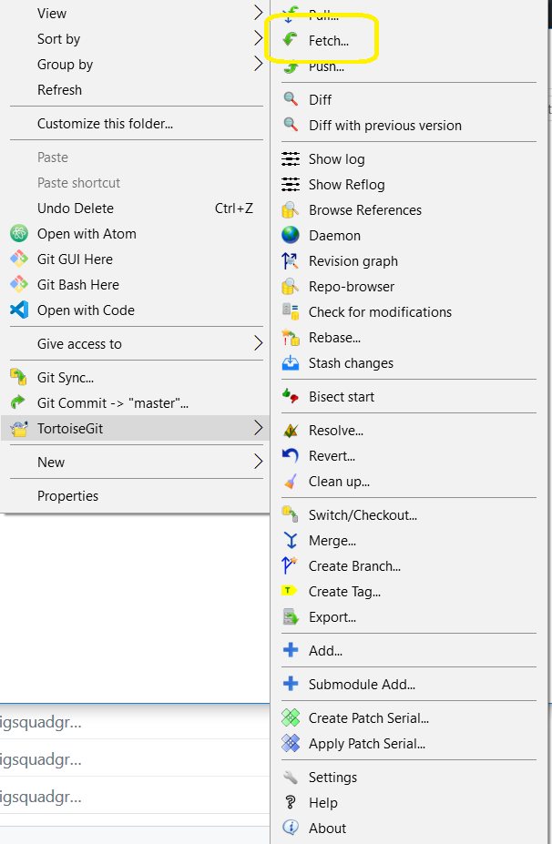
    * Then select 'all' from the dropdown and click Fetch to get the code from both your Fork and the master repo.
    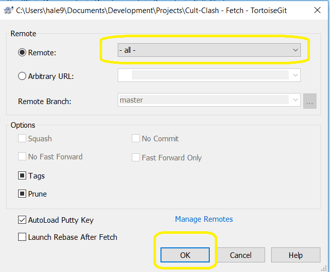
6) You'll want to switch your local repo to the branch you created above.
    * Right click in the folder and select Switch Branches
    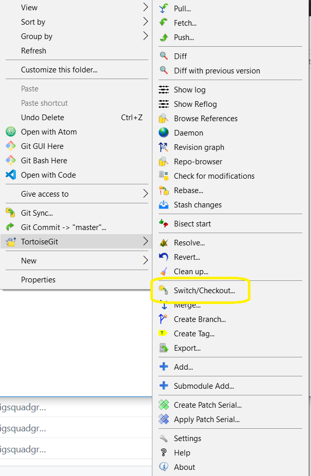
    * Switch to your feature branch that you made above and click ok
    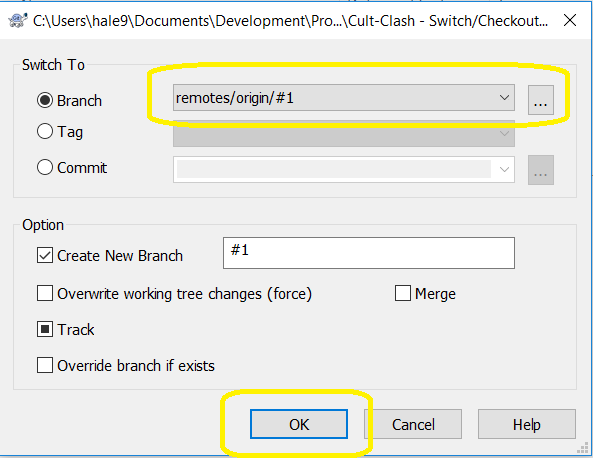
7) Each day, you should try to get your code up-to-date. You do this by doing a 'rebase' to set your current spot in the code to the most up-to-date.
    * This is where the 'upstream' comes into play, where you'll rebase against the master repo.
    * Right click in the folder and select Rebase
    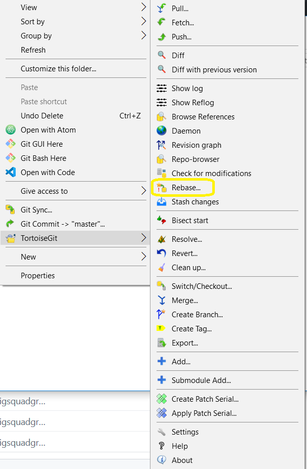
    * Select upstream/master from the dropdown and click Rebase (if it is greyed out, then you are up-to-date!).
    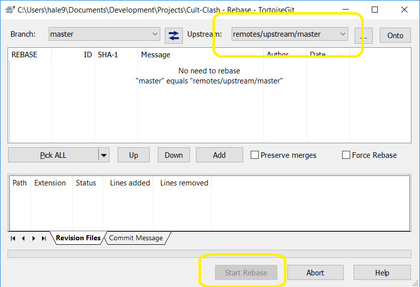
8) Now you'll want to put your changes back into your Fork. Do this by a Commit and Push.
    * Right click in the folder and select Commit
    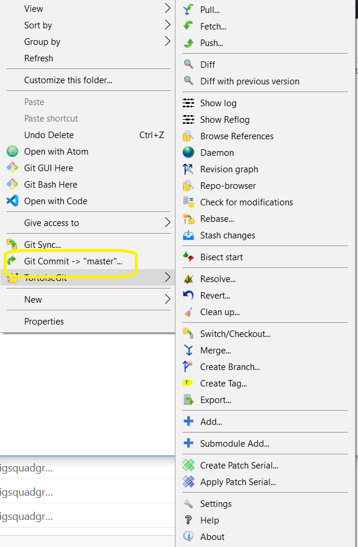
    * Select the files changed that you want to add to the commit and add a message about your commit. Then click Commit. (neat trick, you can Commit and Push right from here!)
    
    * Right click in the folder and select Push.
    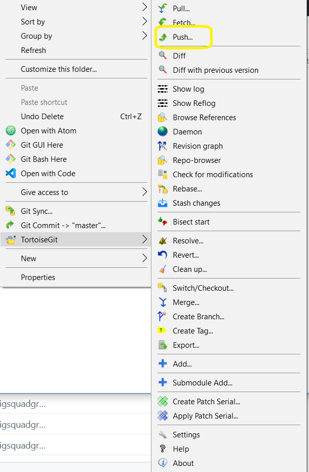
    * Go ahead and push. If you had to do a rebase and had commits, you may need to check 'unknown changes'. Then click ok.
    
9) You'll then want to make a pull request of your code from the UI.
    * In the UI, with your branch selected, click 'Pull Request'
    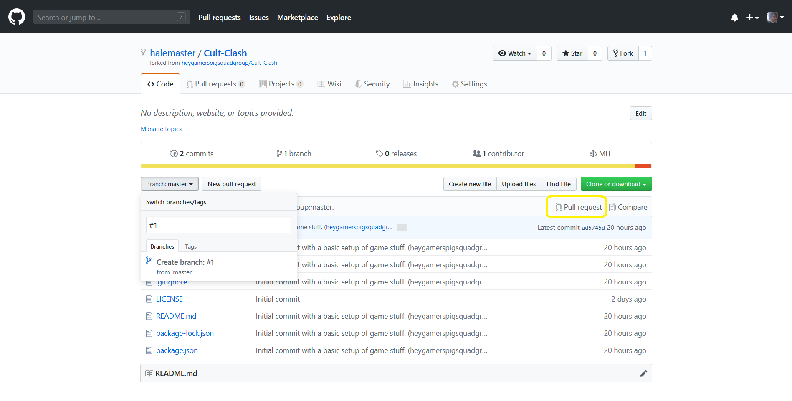
    * Then assign someone as the reviewer, and let them know on Discord.
    * If you get assigned as a reviewer, go over to the code tab of the Pull Request, and then review by either approving, or adding comments and then request changes.
    * Once your PR is approved, select 'Squash and Merge' from the first tab, and then click the button to merge your Pull Request. Now your code is merged! There is an option to close the source branch to clear up your Fork if you'd like.
    > Sorry I don't have pics for this, I can't commit this and add images! I'll try to add some later with the PR from this issue.

## Run Project
1) run `npm install` to install all dependencies.
2) run `npm run start-dev` to start the server.
    > This will build the project, and then start the server.
    > Any changes to the javascript or html sources will rebuild automatically.
